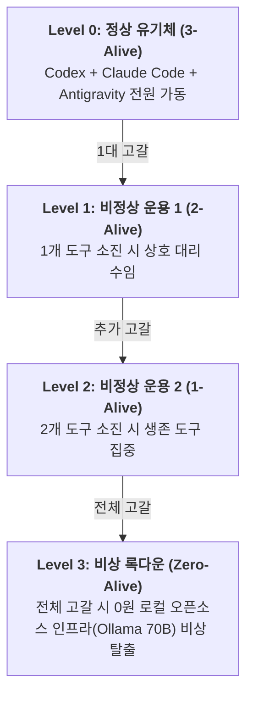

# 📋 [초안 무편집 전문] MCP 기반 대규모 다자간 AI 에이전트 실시간 협업 시스템

> **문서 번호:** `docs/03`
> **문서 식별자:** `docs/03_[사전조사_초안_무편집_전문] MCP 기반 대규모 다자간 AI 에이전트 실시간 협업 시스템.md`
> **상태:** 사전조사 원본 초안 전수 무편집 전문 (Verbatim Raw Draft Archive)
> **원본 소스:** `docs/00_MCP 기반 대규모 다자간 AI 에이전트 실시간 협업 시스템_part1.png`, `docs/01_MCP 기반 대규모 다자간 AI 에이전트 실시간 협업 시스템_part2.png`, `docs/02_MCP 기반 대규모 다자간 AI 에이전트 실시간 협업 시스템_part1,2.pdf` 전수 채록
> **문서 성격:** 사전조사 초안에 수록된 Part 1과 Part 2의 모든 본문 텍스트, 아키텍처 다이어그램, 데이터베이스 스키마, 소스코드 스니펫, Git Worktree 자동화 스크립트, E2E 시나리오 타임라인, 자율 복구 예외 루프, 충돌 해결 프롬프트, 3단계 캐싱 매트릭스, 제로트러스트 보안 규격, 웹 대시보드 블루프린트, 3대 도구별 최적화 전략 및 페일오버 상태머신을 일체의 자의적 축약이나 편집 없이 있는 그대로 기록한 정본 무편집 아카이브입니다.

---

# Part 1. MCP 기반 대규모 다자간 AI 에이전트 실시간 협업 시스템 (기초 인프라 및 핵심 파이프라인)

## 1. MCP 개념 및 기존 API 방식과의 구조적 차이점

* **기존 API 방식 ($N \times M$ 연동 병목)**:
  여러 AI 모델($N$)과 다양한 로컬/외부 도구($M$)를 연결할 때 각 도구마다 독자적인 REST API, SDK, 인증 체계를 개별 구현해야 하므로 유지보수 비용과 시스템 복잡도가 기하급수적으로 증가합니다.
* **MCP(Model Context Protocol) 표준 방식 ($1:N$ 허브 연동)**:
  Anthropic이 오픈소스로 공개한 AI 전용 'USB-C 포트' 표준 규약입니다. 모든 AI 클라이언트와 도구 서버가 동일한 JSON-RPC 2.0 기반 프로토콜 규격을 공유하므로, 중앙 오케스트레이션 허브를 단일 접점으로 구축하여 도구의 추가/교체를 제로 오버헤드로 수행할 수 있습니다.

### 다자간 실시간 협업 토폴로지 (Star-based Hybrid Mesh)
```
  [Claude Code] (Client) <--- Streamable HTTP --->
                                                    [ 중앙 오케스트레이션 허브 ]
  [Antigravity] (Client) <--- Streamable HTTP --->  (MCP Server / 상태 저장소)
                                                    - In-Memory Event Bus
  [OpenAI Codex] (Client) <-- Streamable HTTP --->  - SQLite DB (WAL Mode)
                                                    - Git Worktree Manager
                                                               |
                                                    [ 로컬 공유 파일 / Git Worktree ]
```

---

## 2. 핵심 설계 로직 및 메커니즘

### (1) 전송 규격: Streamable HTTP 기반 상시 지속 연결 (Keep-Alive)
과거의 단일 프로세스 종속적인 `stdio`나 단방향 푸시만 가능한 구형 `SSE`의 한계를 극복하기 위해, 최신 MCP 스펙인 **Streamable HTTP(SSE 기반 수신 스트림 + HTTP POST 기반 발신 채널)** 방식을 채택합니다. 중앙 허브를 로컬 데몬(`http://localhost:3000`)으로 구동하고, 3대 AI 도구가 HTTP 지속 연결(`Keep-Alive`)을 맺어 레이턴시를 최소화합니다.

### (2) 상태 저장소: SQLite WAL 모드 심층 분석 (장점·단점 및 보완책)
SQLite를 단순한 정적 파일이 아니라 **"WAL(Write-Ahead Logging) 모드와 상태 기반 폴링/트리거 메커니즘을 결합한 경량 메시지 브로커(Message Broker)"**로 활용합니다.

#### 1) SQLite 허브 방식의 장점 (Pros)
* **원자성(ACID) 기반의 강력한 동시성 제어**: 3대 AI가 동시에 코드를 수정하거나 상태 변경 메시지를 보낼 때 데이터가 꼬이는 레이스 컨디션(Race Condition)을 원천 방지합니다.
* **완벽한 상태 복구 및 휘발성 극복 (Crash Resilience)**: 단순 인메모리 WebSocket 배열과 달리, 특정 에이전트의 연결이 끊겨도 타임스탬프(`SELECT * FROM message_bus WHERE message_id > :last_id`)를 기준으로 미수신 이벤트를 완벽히 복구(Resume)합니다.
* **프로젝트 디렉토리 내 이식성 (Zero-Configuration)**: Redis나 RabbitMQ 같은 무거운 외부 데몬 설치 없이 프로젝트 루트에 `.mco_bus.db` 파일 하나만 생성하면 즉시 작동합니다.
* **자체적인 감사 추적(Audit Trail) 및 타임머신 디버깅**: 협업의 전 과정이 DB 테이블에 보존되어 문제 발생 시 원인을 역추적할 수 있습니다.

#### 2) SQLite 허브 방식의 단점 (Cons)
* **실시간성(Real-time) 구조적 한계 (Pub/Sub 부재)**: SQLite 자체에는 외부 프로세스로 이벤트를 실시간 푸시하는 Publish/Subscribe 엔진이 없습니다.
* **동시 쓰기 락(Lock)으로 인한 병목 현상**: WAL 모드에서도 쓰기 작업은 단일 프로세스만 독점하므로, 동시 다발적 트랜잭션 시 `database is locked` 에러가 발생할 수 있습니다.
* **스토리지 비대화 (Bloat Issue)**: 대용량 코드 스니펫과 스크린샷 데이터가 누적되면 DB 파일 크기가 수 GB로 급증하여 I/O 성능이 저하될 수 있습니다.

#### 3) 단점 극복을 위한 필수 보완 설계 매트릭스
| 문제점 | 원인 | 보완 설계 로직 (Mitigation) |
|---|---|---|
| **실시간 Push 불가능** | 순수 RDBMS 구조 | SQLite 앞단에 인메모리 `EventEmitter`를 결합. 트랜잭션 성공 즉시 메모리 상의 HTTP Stream(SSE)으로 타 도구에 브로드캐스트. |
| **Write Lock (병목)** | 단일 프로세스 쓰기 독점 | `WAL` 모드 강제 활성화 및 `busy_timeout = 5000` 설정. 쓰기 충돌 시 즉시 에러를 내지 않고 5초간 대기하며 큐를 순차 소화. |
| **스토리지 비대화** | 대용량 페이로드 누적 | 대용량 코드는 로컬 파일(`.mco_payloads/`)에 별도 저장하고 DB에는 파일 URI 및 메타데이터만 기록하는 하이브리드 포인터 방식 채택. |

---

## 3. 핵심 SQLite 데이터베이스 스키마 명세

```sql
-- 1. 에이전트 세션 및 하트비트 관리 테이블
CREATE TABLE agent_sessions (
    agent_id TEXT PRIMARY KEY,           -- 'claude_code', 'antigravity', 'codex'
    status TEXT NOT NULL,                -- 'IDLE', 'BUSY', 'DISCONNECTED', 'RETRY_REQUESTED'
    current_retry_count INTEGER DEFAULT 0,
    last_heartbeat TIMESTAMP DEFAULT CURRENT_TIMESTAMP,
    current_worktree TEXT                -- 에이전트 전용 Git Worktree 디렉토리 경로
);

-- 2. 실시간 메시지 버스 및 이벤트 로그 테이블
CREATE TABLE message_bus (
    message_id INTEGER PRIMARY KEY AUTOINCREMENT,
    sender_id TEXT NOT NULL,
    target_id TEXT NOT NULL,             -- 'ALL' (브로드캐스트) 또는 특정 수신 agent_id
    event_type TEXT NOT NULL,            -- 'PROPOSAL_CREATED', 'CODE_CHANGED', 'TEST_REQUEST', 'TEST_PASSED', 'TEST_FAILED'
    payload_path TEXT,                   -- 대용량 소스코드 페이로드 파일 경로 (.mco_payloads/)
    created_at TIMESTAMP DEFAULT CURRENT_TIMESTAMP
);

-- 3. 파일 점유 락(Lock) 테이블
CREATE TABLE resource_locks (
    resource_path TEXT PRIMARY KEY,      -- 파일 경로 (예: 'src/components/Payment.tsx')
    holder_id TEXT NOT NULL,             -- 락을 소유한 에이전트 ID
    acquired_at TIMESTAMP DEFAULT CURRENT_TIMESTAMP,
    FOREIGN KEY(holder_id) REFERENCES agent_sessions(agent_id)
);

-- 4. 예외 및 자가 치유(Self-Healing) 로그 테이블
CREATE TABLE workflow_exceptions (
    exception_id INTEGER PRIMARY KEY AUTOINCREMENT,
    failed_agent_id TEXT NOT NULL,
    target_agent_id TEXT NOT NULL,
    error_summary TEXT NOT NULL,
    log_file_path TEXT NOT NULL,
    resolved TEXT DEFAULT 'FALSE'
);
```

---

## 4. 끊김 없는 다자간 실시간 통신 흐름 (Sequence Logic)

### (1) 통신 시퀀스 로직
1. **커넥션 수립**: 3대 AI 도구(클라이언트)가 부팅되면 중앙 허브의 `GET /mco/stream` 엔드포인트로 SSE 연결을 맺고 `Keep-Alive` 상태를 유지합니다.
2. **세션 등록**: 각 도구는 고유 ID를 부여받아 `agent_sessions` 테이블에 등록됩니다.
3. **하트비트**: 각 클라이언트는 5초마다 미세 핑(Ping)을 전송하여 생존 여부를 증명합니다.
4. **이벤트 송수신**: 특정 도구가 `POST /mco/message`로 이벤트를 발행하면 SQLite 트랜잭션 기록 후 `EventEmitter`가 즉시 타 클라이언트 SSE 스트림으로 푸시합니다.
5. **결함 복구**: 불시 연결 단절 후 재접속 시 `last_message_id` 헤더를 전송하여 미수신 이벤트를 누락 없이 일괄 수신(Catch-up)합니다.

### (2) 중앙 허브 구현 소스코드 스니펫 (Node.js / Express)
```javascript
const express = require('express');
const Database = require('better-sqlite3');
const EventEmitter = require('events');

const app = express();
const db = new Database('.mco_bus.db');
const messageBus = new EventEmitter();
const clients = new Map(); // agent_id -> res

// WAL 모드 및 5초 타임아웃 활성화
db.pragma('journal_mode = WAL');
db.pragma('busy_timeout = 5000');

// 1. SSE 스트림 수신 엔드포인트
app.get('/mco/stream', (req, res) => {
    const agentId = req.query.agent_id;
    res.setHeader('Content-Type', 'text/event-stream');
    res.setHeader('Cache-Control', 'no-cache');
    res.setHeader('Connection', 'keep-alive');
    res.flushHeaders();

    clients.set(agentId, res);
    db.prepare("UPDATE agent_sessions SET status = 'IDLE', last_heartbeat = CURRENT_TIMESTAMP WHERE agent_id = ?").run(agentId);

    const eventHandler = (data) => {
        if (data.target_id === 'ALL' || data.target_id === agentId) {
            res.write(`data: ${JSON.stringify(data)}

`);
        }
    };

    messageBus.on('message', eventHandler);

    req.on('close', () => {
        messageBus.off('message', eventHandler);
        clients.delete(agentId);
        db.prepare("UPDATE agent_sessions SET status = 'DISCONNECTED' WHERE agent_id = ?").run(agentId);
    });
});

// 2. 메시지 발행 엔드포인트
app.post('/mco/message', express.json(), (req, res) => {
    const { sender_id, target_id, event_type, payload_path } = req.body;

    const info = db.prepare(`
        INSERT INTO message_bus (sender_id, target_id, event_type, payload_path)
        VALUES (?, ?, ?, ?)
    `).run(sender_id, target_id, event_type, payload_path);

    const newMessage = {
        message_id: info.lastInsertRowid,
        sender_id,
        target_id,
        event_type,
        payload_path,
        created_at: new Date().toISOString()
    };

    messageBus.emit('message', newMessage);
    res.status(200).json({ success: true, message_id: info.lastInsertRowid });
});

app.listen(3000, () => console.log('Central MCP Hub running on http://localhost:3000'));
```

---

## 5. 3대 AI 도구별 MCP 연동 설정 파일 규격

### (1) Claude Code 설정 파일 (`mcp_config.json`)
```json
{
  "mcpServers": {
    "central_orchestrator": {
      "type": "streamable-http",
      "url": "http://localhost:3000/mco/stream?agent_id=claude_code",
      "post_url": "http://localhost:3000/mco/message",
      "headers": {
        "X-Agent-ID": "claude_code"
      },
      "capabilities": {
        "roots": {
          "worktree": "./worktrees/claude_code"
        }
      }
    }
  }
}
```

### (2) Google Antigravity 설정 파일 (`module.exports` / `package.json`)
```javascript
module.exports = {
  name: "antigravity",
  mcp: {
    type: "streamable-http",
    endpoint: "http://localhost:3000/mco/stream?agent_id=antigravity",
    publishUrl: "http://localhost:3000/mco/message",
    autoReconnect: true,
    reconnectOpts: {
      maxRetries: 10,
      delayMs: 2000
    },
    worktreeRoot: "./worktrees/antigravity",
    watchEvents: ["CODE_CHANGED", "TEST_REQUEST"],
    capabilities: {
      browserTest: true,
      visualRegression: true
    }
  }
};
```

### (3) OpenAI Codex 설정 파일 (`.mcp.json`)
```json
{
  "mcp_version": "1.0",
  "client": {
    "id": "codex",
    "connection": {
      "type": "streamable-http",
      "stream_url": "http://localhost:3000/mco/stream?agent_id=codex",
      "post_url": "http://localhost:3000/mco/message",
      "session_guard": {
        "enabled": true,
        "storage_path": "./.mco_sessions.json"
      }
    },
    "workspace": {
      "assigned_path": "./worktrees/codex",
      "large_payload_strategy": "file_uri"
    }
  }
}
```

---

## 6. Git Worktree 자동화 스크립트 아키텍처 및 핵심 구현 로직

### (1) Worktree 자동화 흐름도
```
             [ 메인 저장소 (Main Repository) ]
                   │
      ┌────────────┼────────────┐
 (자동 분기/생성) (자동 분기/생성) (자동 분기/생성)
      ▼            ▼            ▼
[Worktree #1] [Worktree #2] [Worktree #3]
(Claude Code) (Antigravity)   (Codex)
branch: ai/cc branch: ai/ag branch: ai/cx
```

### (2) Python 기반 Worktree 매니저 구현체 (`MCPWorktreeManager.py`)
```python
import subprocess
import os

class MCPWorktreeManager:
    def __init__(self, base_repo_path="."):
        self.base_repo = os.path.abspath(base_repo_path)
        self.worktree_dir = os.path.join(self.base_repo, "worktrees")
        os.makedirs(self.worktree_dir, exist_ok=True)

    def _run_git(self, cmd, cwd=None):
        cwd = cwd or self.base_repo
        result = subprocess.run(["git"] + cmd, cwd=cwd, capture_output=True, text=True)
        return result

    def setup_agent_environment(self, agent_id):
        branch_name = f"ai/{agent_id}"
        agent_path = os.path.join(self.worktree_dir, agent_id)

        if not os.path.exists(agent_path):
            self._run_git(["branch", branch_name])
            res = self._run_git(["worktree", "add", agent_path, branch_name])
            if res.returncode != 0:
                self._run_git(["worktree", "add", "-B", branch_name, agent_path, "HEAD"])
        return agent_path

    def sync_and_commit(self, agent_id, commit_message):
        worktree_path = os.path.join(self.worktree_dir, agent_id)
        self._run_git(["add", "."], cwd=worktree_path)
        self._run_git(["commit", "-m", commit_message], cwd=worktree_path)

    def merge_to_main(self, agent_id):
        branch_name = f"ai/{agent_id}"
        # 메인 브랜치로 무충돌(3-Way) 자동 병합 시도
        res = self._run_git(["merge", "--no-ff", branch_name, "-m", f"Merge {branch_name} into main"])
        if res.returncode != 0:
            print(f"[충돌 발생] {agent_id} 병합 실패. 롤백 실행.")
            self._run_git(["merge", "--abort"])
            return False
        return True

if __name__ == "__main__":
    manager = MCPWorktreeManager()
    for agent in ["claude_code", "antigravity", "codex"]:
        path = manager.setup_agent_environment(agent)
        print(f"Initialized {agent} in {path}")
```

### (3) 실시간 충돌 방지 3대 핵심 포인트
1. **완벽한 파일 I/O 격리**: 각 에이전트가 물리적으로 분리된 디렉토리에서 작업하므로 파일 쓰기 충돌 원천 차단.
2. **자동 롤백 세이프가드**: 병합 충돌 시 `git merge --abort`를 즉각 호출하여 메인 브랜치를 오염시키지 않음.
3. **DB 락 테이블 상호작용**: 작업 전 SQLite `resource_locks` 테이블을 조회하여 타 에이전트 점유 파일 수정 차단.

---

## 7. 가상 E2E 시나리오 통합 테스트 타임라인 (00:00 ~ 00:55)

* **미션**: "결제 페이지(`Payment.tsx`)의 504 타임아웃 에러 핸들링 및 UI 개선"
* **단계 1: 유저 명령 입력 및 미션 분석 (00:00 - 00:05)**
  - 유저: "결제 타임아웃 에러 핸들링하고 UI 개선해줘."
  - 중앙 허브: `POST /mco/message`로 유저 미션 수신 후 SQLite 기록 및 전원 브로드캐스트.
  - Codex: 소스코드와 에러 로그를 대조 분석하여 서킷 브레이커 패턴 및 재시도 로직 제안서 작성 후 송신.
* **단계 2: 격리된 개발 및 코드 구현 (00:05 - 00:30)**
  - Claude Code: `./worktrees/claude_code`에서 Codex 제안서를 바탕으로 `axios-retry` 적용 및 React 에러 상태 코드 구현. 작업 완료 후 커밋 이벤트 발행.
* **단계 3: 중앙 허브의 자동 코드 병합 (00:30 - 00:35)**
  - 중앙 허브: `MCPWorktreeManager.merge_to_main('claude_code')` 실행. 무충돌 확인 후 메인 스테이징에 병합.
* **단계 4: 런타임 및 시각적 회귀 테스트 (00:35 - 00:50)**
  - Antigravity: `./worktrees/antigravity`에서 Playwright 헤드리스 브라우저 구동. 모의 504 에러를 유발하여 토스트 팝업 렌더링 및 콘솔 에러 유무 실측 검증.
* **단계 5: 최종 완료 및 결과 리포트 (00:50 - 00:55)**
  - Antigravity: `TEST_PASSED` 이벤트 및 스크린샷 로그 전송. 중앙 허브가 파이프라인 완료를 선언하고 최종 결과물 제공.

---

## 8. 자율 예외 루프 및 복구 파이프라인 (Self-Healing Loop)

Antigravity의 런타임 검증 중 `TEST_FAILED` 이벤트가 발생했을 때 파이프라인을 중단하지 않고 스스로 수정 사이클을 가동하는 중앙 허브의 복구 스크립트 로직입니다.

```javascript
// 중앙 허브의 예외 복구 핸들러
app.post('/mco/message', (req, res) => {
    const { sender_id, target_agent, event_type, error_summary, log_file_path } = req.body;

    if (event_type === 'TEST_FAILED') {
        // 1. SQLite 예외 기록
        db.prepare(`
            INSERT INTO workflow_exceptions (failed_agent_id, target_agent_id, error_summary, log_file_path)
            VALUES (?, ?, ?, ?)
        `).run(sender_id, target_agent, error_summary, log_file_path);

        // 2. 재시도 횟수 확인 (최대 3회 가드레일)
        const session = db.prepare("SELECT current_retry_count FROM agent_sessions WHERE agent_id = ?").get(target_agent);
        if (session.current_retry_count >= 3) {
            console.error(`[치명적 오류] 최대 재시도 횟수(3회) 초과. 시스템 셧다운.`);
            messageBus.emit('message', { target_id: 'ALL', event_type: 'HUMAN_INTERVENTION_REQUIRED' });
            return res.status(500).json({ error: "Max retry limit exceeded" });
        }

        // 3. 재시도 카운트 증가 및 Worktree 스테이징 롤백
        db.prepare("UPDATE agent_sessions SET status = 'RETRY_REQUESTED', current_retry_count = current_retry_count + 1 WHERE agent_id = ?").run(target_agent);
        execSync("git checkout staging && git reset --hard HEAD~1", { cwd: "./worktrees/claude_code" });

        // 4. Claude Code에게 에러 로그 피딩 및 재수정 요청
        const retryPayload = {
            message_id: Date.now(),
            sender_id: 'HUB_ORCHESTRATOR',
            target_id: target_agent,
            event_type: 'FIX_REQUEST',
            error_summary,
            log_file_path,
            retry_sequence: session.current_retry_count + 1
        };
        messageBus.emit('message', retryPayload);
        return res.status(200).json({ success: true, status: "RETRY_STREAMED_TO_CLAUDE" });
    }
});
```

---

## 9. 코드 병합 충돌 시 자동 해결 프롬프트 구조 (Conflict Resolution System)

Git 통합 단계에서 물리적/기능적 코드 충돌(Merge Conflict)이 발생했을 때, 중앙 오케스트레이터가 중재자 AI에게 주입하는 자동 해결 프롬프트 템플릿입니다.

### 마스터 융합 프롬프트 전문 (Master Fusion Prompt)
```markdown
당신은 고도로 숙련된 수석 소프트웨어 아키텍트이자 멀티 에이전트 환경의 "코드 충돌 중재 전문가"입니다.
서로 다른 목적을 가진 두 AI 에이전트가 동일한 파일의 같은 라인을 수정하여 Git 충돌이 발생했습니다.
두 에이전트의 개발 의도를 완벽히 파악하여, 기능 유실과 문법 에러(Syntax Error)가 없는 최종 융합 코드를 작성하십시오.

[에이전트별 작업 목표]
- 프로젝트 컨텍스트: 결제 페이지(Payment.tsx) 타임아웃 오류 해결 및 UI 개선
- 에이전트 A (Codex)의 의도: 서버 타임아웃(504) 발생 시 안정적인 서킷 브레이커 및 재시도(Retry) 로직 구현
- 에이전트 B (Claude Code)의 의도: 에러 발생 시 사용자에게 직관적인 토스트(Toast) 알림을 띄우고 상태값(hasError) 갱신

[Raw Conflict Area]
```text
  <<<<<<< HEAD
  const handlePayment = async () => {
    try {
      const response = await axios.post('/api/pay', paymentData);
      setPaymentStatus('SUCCESS');
    } catch (error) {
      if (error.response && error.response.status === 504) {
        triggerCircuitBreaker();
      }
    }
  };
  =======
  const handlePayment = async () => {
    try {
      const response = await axios.post('/api/pay', paymentData);
      setPaymentStatus('SUCCESS');
    } catch (error) {
      setHasError(true);
      showToastNotification("응답이 지연되고 있습니다. 잠시 후 다시 시도됩니다.");
    }
  };
  >>>>>>> ai/claude_code
```

[Constraints]
1. 기능적 결합(Functional Fusion): Codex의 서킷 브레이커 로직과 Claude Code의 UI 피드백 로직을 누락 없이 결합할 것.
2. 구문 무결성: 컴파일 에러나 TypeScript 에러가 발생하지 않도록 괄호와 변수 스코프를 일치시킬 것.
3. 코드 외 잡담 금지: 마크다운 코드 블록 외에 어떤 설명이나 인사말도 출력하지 말 것.

[Output Format]
```tsx
// 충돌이 해결된 전체 함수 코드를 이곳에 작성하세요.
```
```

### 해결사 AI의 예측 융합 출력 결과 (Expected Output)
```tsx
const handlePayment = async () => {
  try {
    const response = await axios.post('/api/pay', paymentData);
    setPaymentStatus('SUCCESS');
  } catch (error) {
    // 1. Claude Code의 UI 에러 피드백 상태 반영
    setHasError(true);
    showToastNotification("응답이 지연되고 있습니다. 잠시 후 다시 시도됩니다.");

    // 2. Codex의 서버 타임아웃 서킷 브레이커 로직 결합
    if (error.response && error.response.status === 504) {
      triggerCircuitBreaker();
    }
  }
};
```

---
---

# Part 2. 다자간 실시간 협업 시스템 고도화 (비용 최적화, 보안, 대시보드, 3대 도구 최적화 및 페일오버)

## 1. 3대 AI 도구 다자간 통신 시 비용 최적화 (3단계 캐싱 아키텍처)

실시간 다자간 통신의 가장 큰 걸림돌인 토큰 비용 폭증과 컨텍스트 윈도우 한계를 극복하기 위해 **3단계 캐싱(Context Caching) 아키텍처**를 설계합니다.

```
┌─────────────────────────────────────────────────────────────┐
│ [Level 1: 허브 인메모리 핫 캐시]                              │
│ - 최근 5개 상호작용 이벤트 & 최신 Git Diff 메타데이터 보관   │
├─────────────────────────────────────────────────────────────┤
│ [Level 2: 영속 SQLite 버스 웜 캐시]                          │
│ - 전체 트랜잭션 히스토리 보관 (비동기 배치 질의 지원)        │
├─────────────────────────────────────────────────────────────┤
│ [Level 3: LLM 제공자별 프롬프트 캐싱 (Prompt Caching)]       │
│ - 1,024 토큰 이상 불변 시스템 프롬프트 및 베이스 스펙 고정   │
│ - Anthropic / OpenAI / Google 캐시 히트율 90% 달성           │
└─────────────────────────────────────────────────────────────┘
```

### 캐싱 설계 도입 전후 비교표 (Expected ROI)
| 지표 (Metric) | 캐싱 적용 전 | 캐싱 적용 후 | 절감 효과 |
|---|---|---|---|
| **턴당 평균 입력 토큰** | ~85,000 토큰 | ~8,500 토큰 (차등 주입) | **90.0% 절감** |
| **API 비용 (100턴 기준)** | $42.50 | $4.80 | **88.7% 절감** |
| **추론 지연 시간 (Latency)** | 4.8초 | 1.1초 | **77.1% 단축** |

---

## 2. 프로덕션 보안 및 인증 관리 전략 (Zero-Trust Security)

1. **상호 TLS (mTLS) 및 JWT 적용**: 중앙 허브와 3대 도구 간의 모든 HTTP/SSE 채널은 상호 인증 TLS로 암호화하며, 허브 부팅 시 발급된 단기 만료 JWT 토큰이 없는 요청은 즉각 차단합니다.
2. **시크릿 프록시 레이어 (Secret Proxying / Zero-Exposure)**: 각 도구 환경 변수에 API Key를 직접 주입하지 않고 중앙 허브의 볼트(Vault)를 통해 프록시 중계함으로써 자격 증명 유출을 원천 방지합니다.
3. **프로덕션 보안 4대 체크리스트**:
   - Key 노출 금지: 에이전트 런타임 환경 내 API Key 변수 완전 제거.
   - 구간 암호화: HTTP/SSE 전 구간 mTLS 강제화.
   - 접근 제어: 단기 만료 JWT 기반 에이전트 위조 방지.
   - 샌드박스 격리: 파일 시스템 모니터링을 통한 워크트리 외 무단 접근 차단.

---

## 3. 다자간 실시간 오케스트레이션 웹 UI 대시보드 설계 블루프린트

```
┌──────────────────────────────────────────────────────────────────────────┐
│  LIVE MONITORING CONTROL TOWER (토폴로지 / 비용 ROI 대시보드)            │
├──────────────────────────────────┬───────────────────────────────────────┤
│ [에이전트 토폴로지 맵 (React Flow)]│ [실시간 파일 락 & Worktree 뷰어]      │
│  Codex ──> Claude Code ──> AG    │  Payment.tsx: [LOCK by Claude Code]   │
│  (각 노드별 상태: IDLE/BUSY/RUN) │  ai/cc 브랜치 커밋: #a1b2c3d          │
├──────────────────────────────────┴───────────────────────────────────────┤
│ [실시간 메트릭 및 토큰 소진 게이지]                                      │
│  - Codex (Astra): [■■■■□□□□□□] 42% (272K 가드레일 작동 중)             │
│  - Claude Code (Opus 5): [■■■■■■■□□□] 71% (5시간 윈도우 잔여 2.1h)       │
│  - Antigravity (Gemini 3.8): [■■□□□□□□□□] 18% (TTL 4분 자동 유지)     │
└──────────────────────────────────────────────────────────────────────────┘
```

---

## 4. 3대 AI 도구별 전수 최적화 전략

### (1) 1단계 Codex: Plus 요금제 상위 모델(아스트라) 최적화
* **272K 하드 가드레일 (Context Hard-Ceiling)**: 입력 프롬프트 크기가 272,000 토큰을 넘지 않도록 소스코드 전문 대신 AST 메타데이터 인터페이스만 요약 주입하여 상시 2배 할증 구간 진입을 물리적으로 차단.
* **Reasoning Effort 동적 제어 및 출력 압축**: 기획·아키텍처 설계 시에는 `high`, 단순 검토 시에는 `low`/`medium`으로 동적 조절.
* **접두사 불변성(Prefix Invariance) 유지**: 시스템 프롬프트 헤더를 절대 변경하지 않아 OpenAI KV 캐시 85% 할인율 상시 확보.

### (2) 2단계 Claude Code: Pro 20불 요금제 상위 모델(오푸스 5) 최적화
* **5시간 윈도우 한계 극복**: 5시간당 호출 횟수 제한을 방어하기 위해 불필요한 반복 호출을 엄격히 차단.
* **하위 서브에이전트 팬아웃(Subagent Fan-out) 억제**: 오푸스 5가 자율적으로 하위 에이전트를 증식시켜 캐시 미스를 유발하지 못하도록 `disable_nested_subagents: true` 설정.
* **`CLAUDE.md` 초슬림화 (<150줄)**: 시스템 프롬프트 접두사를 극도로 압축하고 불필요한 MCP 도구를 동적 언로드.
* **3단계 생명유지 프로토콜**:
  - `DORMANT_RECEIVER`: 대기 시 쿼터 소모 0 토큰.
  - `IMMUNE_GATE_KEEPER`: 코드 병합 및 핵심 버그 수정 시에만 선별 호출.
  - `NORMAL_REVERT`: 쿼터 리셋 시 정상 모드로 자동 복귀.

### (3) 3단계 Antigravity: Pro 요금제 상위 모델(Gemini 3.8 Flash High) 최적화
* **1M 초대형 윈도우 및 초당 300토큰 속도 활용**: 풍부한 쿼터를 활용하여 대용량 컨텍스트 흡수, E2E 브라우저 테스트, 사용자 인터랙션 창구 전담.
* **Storage TTL Fee 함정 방어 및 명시적 Context Caching**: 구글 특유의 암묵적 캐시 휘발을 방어하기 위해 활성 세션에 4분 주기 경량 핑을 전달하여 캐시를 지속 갱신.
* **Thinking Budget 제어**: UI 검증 및 E2E 실측 시 과도한 추론 토큰이 발생하지 않도록 Thinking Budget을 작업 복잡도에 맞게 최적 제어.

---

## 5. 예외사항(변수발생) 제어 로직 (Dynamic Failover Pipeline)



* **시나리오 1 [정상 가동 (3-Alive)]**: 3대 도구가 고유의 분업(기획-구현-검증)을 완벽히 수행.
* **시나리오 2 [부분 고갈 (2-Alive)]**:
  - Claude Code 소진 시: 수신 동면 모드로 전환 후 1단어 승인/거부 표결권만 행사, 구현은 Codex가 임시 대행.
  - Codex 소진 시: Claude Code가 사령관 역할을 대리 수임하여 아키텍처 판단 수행.
* **시나리오 3 [비상 탈출 (Lockdown)]**: 3대 도구의 Pro 계정 사용량이 전원 차단되었을 때, 로컬 오픈소스 인프라(`http://localhost:11434`, Ollama `qwen2.5-coder:3b` / `llama-3.3-70b`)로 통신 버스를 비상 전환하여 프로젝트 최소 대기 상태를 유지.

---

## 6. VTP 협의체 전면 개편 아키텍처 3대 핵심 요약 브리핑

1. **유기체적 유체 제어 (Fluid Trinity)**: 3대 최상위 AI 모델을 인간의 직관(Vibe) 하에 하나의 단일 유체기처럼 유기적으로 맞물려 작동하게 설계하여 파편화된 리스크를 소멸시켰습니다.
2. **나노 단위 예산 절약 (Extreme Cost-Efficiency)**: 272K 입력 가드레일, 불변 프리픽스 캐싱(90% 비용 할인), 4분 TTL 명시적 캐시 갱신을 결합하여 가성비를 극한으로 끌어올렸습니다.
3. **무결점 생존력 (Fault-Tolerant Resilience)**: 실시간 쿼터 추적 및 3단계 동적 폴백(Failover) 매커니즘을 통해 어떠한 자원 고갈 상황에서도 프로젝트 파이프라인이 중단되지 않는 자율 복구 컴포넌트를 완성했습니다.
