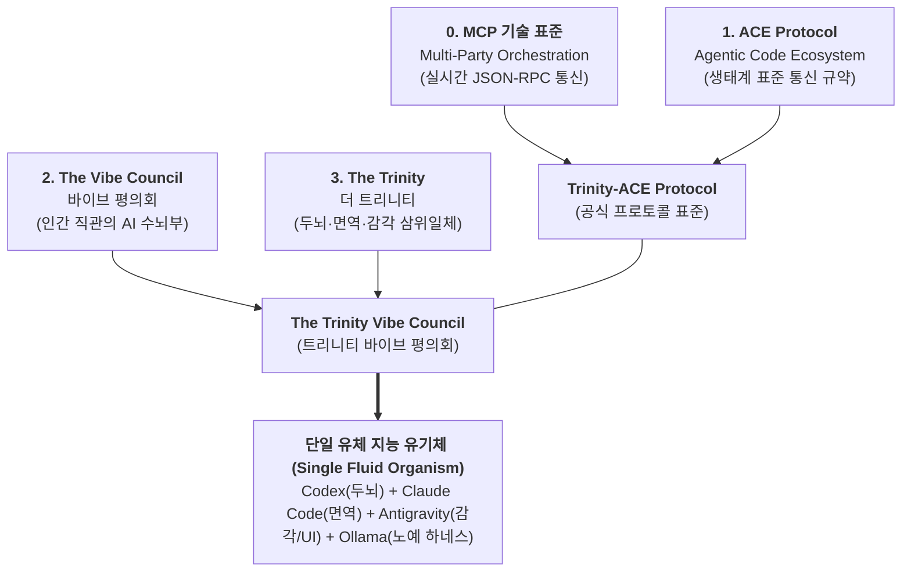

# [전략 설계] MCP 기반 다자간 AI 오케스트레이션 프레임워크 (Trinity-ACE Protocol) 종합 계획서

> **문서 번호:** `docs/05`
> **문서 식별자:** `docs/05_[전략 설계] MCP 기반 다자간 AI 오케스트레이션 프레임워크 (Trinity-ACE Protocol) 개편 계획서 (implementation_plan).md`
> **상태:** 제정 및 확정 (ESTABLISHED / VERIFIED)

본 문서는 기존 협의체를 전면 해체 및 재설계하고, **"예산절약 모드(가성비 극대화)"를 기본 상시 하네스(Default Base Harness)로 고정**하며, **3대 AI 도구(Codex, Claude Code, Antigravity)의 유기체적 결합(단일 유체기 모델) 및 Ollama 로컬 0원 노예 하네스**를 결합하는 차세대 다자간 실시간 협업 프레임워크의 종합 헌법과 단계별 상세 설계 규격서입니다.

---

## 🏛️ 공식 명칭 및 브랜드 아키텍처 (Brand Synthesis)

사용자의 지침에 따라 전 영역(로컬 워크스페이스, git 저장소, 문서, 코드, 대화)에서 구시대적 약어를 완전히 폐기·정제하고, 제시된 4대 핵심 가치를 완벽히 융합한 새 공식 명칭을 선포합니다.



### 공식 명칭 체계표
| 구분 | 공식 국문 명칭 | 공식 영문 명칭 | 정의 및 역할 |
|---|---|---|---|
| **프로토콜 표준** | **트리니티-에이스 프로토콜** | **Trinity-ACE Protocol** | MCP 기반 다자간 에이전트 실시간 오케스트레이션 표준 규약 (Agentic Code Ecosystem) |
| **수뇌 평의회** | **트리니티 바이브 평의회** | **The Trinity Vibe Council** | 사용자의 직관(Vibe)을 자율 실체화하는 3대 프론티어 AI 협력 기구 |
| **전체 기술 프레임워크** | **MCP 기반 실시간 다자간 AI 오케스트레이션 프레임워크** | **Multi-Party AI Agent Real-Time Orchestration Framework via MCP** | 로컬 소켓/STDIO 및 표준 MCP 버스로 결합된 전체 런타임 생태계 |

---

## 🧬 3대 AI 도구의 '단일 유체기(Fluid Organism)' 유기적 결합 비유

본 프레임워크는 도구들을 개별 독립 소프트웨어로 보지 않고, 하나의 유체(Fluid)처럼 막힘없이 순환하며 압력과 부하에 따라 점도와 유속을 동적으로 조절하는 **"단일 지능 유체기"**로 모델링합니다.

```
       ┌─────────────────────────────────────────────────────────────┐
       │                [사용자 / 창조자 (Human Vibe)]               │
       └──────────────────────────────┬──────────────────────────────┘
                                      │ (직관, 방향성, P2 승인)
                                      ▼
       ┌─────────────────────────────────────────────────────────────┐
       │     [Antigravity] 감각기관 / 피부 / 상임 대변인 (Sensory & UI) │
       │     - 대용량 토큰 흡수, 사용자 인터랙션, 브리핑, E2E 검증     │
       └──────────────┬───────────────────────────────┬──────────────┘
                      │ (3줄 초압축 작업카드)            │ (0원 데이터 전처리)
                      ▼                               ▼
       ┌──────────────────────────────┐ ┌─────────────────────────────┐
       │  [Codex] 상위 두뇌 / 사령관   │ │  [Ollama] 신진대사 / 노예하네스 │
       │  - MIA 기획, 전략 수렴, 뇌수막 │ │  - 로컬 0원 무제한 연산        │
       │  - 희소 토큰 극대화 보존     │ │  - 정규식, 모의데이터, 스캔   │
       └──────────────┬───────────────┘ └─────────────────────────────┘
                      │ (핵심 아키텍처 전달)
                      ▼
       ┌─────────────────────────────────────────────────────────────┐
       │   [Claude Code] 면역계 / 신경근육계 (Immune System & Muscle)   │
       │   - 코드 무결성 방어, 결함 격리, 1회 바이너리 게이트키퍼     │
       └─────────────────────────────────────────────────────────────┘
```

---

## ⚡ 0단계 완료 : 예산절약 기본 하네스(Default Base) 및 3대 폴백 상태머신

### 1. 3층 예산절약 아키텍처
* **[1층] 동적 정책 라우터 (Dynamic Policy Router)**: FrugalGPT & RouteLLM 기반으로 작업 복잡도를 3초 내 분류하여 단순 작업은 Ollama(0원), 대용량 리서치는 Antigravity, 핵심 판단만 상위 도구로 분기.
* **[2층] 비대칭 쿼터 원장 및 차단기 (Budget Ledger & Circuit Breaker)**: BAMAS 기반으로 실시간 쿼터를 추적하고 429 감지 시 1초 내 서킷 브레이커 작동.
* **[3층] 품질 관문 및 컨텍스트 실드 (Quality Gate & Context Shield)**: 통신세 원천 차단(3줄 작업카드 유통), Ollama 15초 초과 시 1회 승격(Fail-Fast), 단계별 사령관 확인 관문 강제.

### 2. 변수 발생 대응 3대 폴백 상태머신
* **상태 1 [3-Alive (정상 유기체)]**: Codex(두뇌) + Claude Code(면역) + Antigravity(감각/대변인) + Ollama(노예) 전원 생존 삼위일체 풀가동.
* **상태 2 [2-Alive (비정상 운용 1)]**:
  - *Claude 소진 시*: `DORMANT_RECEIVER`(수신 전용 대기) 유지, P2 고위험 작업만 `IMMUNE_GATE_KEEPER`로 1단어(YES/NO) 표결.
  - *Codex 소진 시*: Claude Code가 **사령관 대행(Acting Commander)**으로 즉시 승격하여 단절 없는 인가 지속.
  - *Antigravity 소진 시*: Codex가 직접 CLI로 Ollama를 지휘하며 간이 대면 브리핑.
* **상태 3 [1-Alive (비정상 운용 2)]**: 단 1대 도구만 생존 시 로컬 Ollama를 하네스로 삼아 고립 방어 모드 가동 및 사용자에게 **비상 직소(`EMERGENCY_USER_WHISTLEBLOW`)** 발령.

---

## 🧠 1단계 완료 : Codex 사령관 최적화 — Plus 요금제 플래그십(아스트라급) 가성비 극대화

1. **Codex 역할**: 작전 사령관(두뇌), P2 거버넌스 최고 관문, Zero Raw Data 원칙(원시 데이터 직접 열람 금지).
2. **5대 절약 비법**:
   - 프롬프트 접두사 불변성(Prefix Invariance) & 1,024 토큰 자동 KV 캐싱 극대화 (85% 절감).
   - Zero Code Pollution: 스켈레톤 AST(클래스/메서드 시그니처)만 주입하여 토큰 95% 절감.
   - Single-Turn Single-Shot: 핑퐁 대화 차단, 1턴 1판정 완결.
   - 동적 추론 강도 (Reasoning Effort: Low / Medium / High) 제어.
   - 간결한 목표 중심 직접 지시 (`TRINITY_DECISION_PACK` 표준 규격).

---

## 🛡️ 2단계 완료 : Claude Code 면역계 최적화 — Pro 20불 요금제 최상위 모델(Opus 5급) 가성비 극대화

1. **Claude Code 역할**: 면역계 수호자, 무결성 정밀 검증기, 외과 수술적 리팩토링 근육(Scoped Patch).
2. **5대 절약 비법**:
   - 3단계 생명유지 프로토콜(DORMANT_RECEIVER ➔ IMMUNE_GATE_KEEPER ➔ NORMAL_REVERT)로 쿼터 소진 시에도 헌법 영구 보존.
   - 서브에이전트 원천 차단(`disable_nested_subagents: true`) 및 에이전틱 리서치 외주화.
   - Lean `CLAUDE.md` (<150줄) 및 미사용 MCP 도구 동적 언로드.
   - 터미널 노이즈 실드 (RTK 패턴: Exit Code 0 및 3줄 에러 벡터만 수신).
   - 세션 인계 컴팩션 (The Handoff & `/clear` Protocol).

---

## 👁️ 3단계 완결 : Antigravity 감각기/창구 최적화 — Gemini 3.8 Flash High 및 Ollama 0원 노예 하네스 연동

### 1. Antigravity의 정밀 역할 정의 (Sensory Receptor & Interface Gateway)
* **상임 대변인 (Delegated Spokesperson)**: 사용자와 직접 맞닿는 유일한 UI/UX 창구. 풍부한 Pro 쿼터로 장문의 자연어 대화, 기획 분석, 실행 결과 브리핑을 100% 흡수.
* **대용량 토큰 완충재 (Heavy-Token Shock Absorber)**: 웹 딥리서치, 수천 줄 코드베이스 인덱싱, 복잡한 문서 분석을 직접 수행하여 Codex와 Claude Code에 유입되는 토큰 충격을 차단.
* **오케스트레이션 현장 감독 (Runtime Orchestrator)**: Codex의 아키텍처 결정을 하달받아 로컬 Ollama에게 세부 작업을 지시하고, 브라우저/CLI 검증을 거쳐 최종 결과를 사용자에게 렌더링.

---

### 2. 최상위 모델(Gemini 3.8 Flash High) 가성비 극대화 4대 비법 (/OPTIMIZE /DEEPDIVE)

```
 ┌────────────────────────────────────────────────────────────────────────┐
 │           Antigravity를 위한 4대 대용량 토큰 세이빙 가드레일           │
 ├────────────────────────────────────────────────────────────────────────┤
 │ 1. 암시적/명시적 컨텍스트 캐싱 ➔ 고정 프리픽스 90% 토큰 할인 극대화   │
 │ 2. Thinking Budget 가드레일    ➔ 불필요한 내부 독백 및 출력 토큰 억제  │
 │ 3. Structured JSON Schema      ➔ 서술형 잡담 배제, Enum 기반 엄격 출력│
 │ 4. XML 태그 컨텍스트 격리     ➔ 초장문 컨텍스트 드리프트(Drift) 방지 │
 └────────────────────────────────────────────────────────────────────────┘
```

1. **암시적/명시적 컨텍스트 캐싱 (Context Caching ~90% 절감)**:
   * 고정 시스템 지침, 프로젝트 디렉터리 맵, 고유 규칙을 프롬프트 맨 앞단에 배치하여 Google 인프라의 자동 컨텍스트 캐싱(Implicit Cache)을 트리거.
2. **Thinking Budget 동적 제어 (Thinking Budget Guardrail)**:
   * 단순 라우팅이나 파일 포맷팅, UI 렌더링 작업 시 불필요한 내부 생각(Thinking) 토큰이 폭증하지 않도록 상한선을 강제하거나 단순 작업 시 비활성화.
3. **Structured Response Schema (JSON / Enum 강제)**:
   * 에이전트 간 전달 데이터는 `response_schema`를 통해 JSON 및 Enum 값으로 강제하여 모델의 서술형 미사여구(Filler tokens)를 100% 제거.
4. **XML 태그 기반 컨텍스트 격리 (`<context>`, `<evidence>`)**:
   * 초대용량 컨텍스트 주입 시 지침이 희석되는 현상을 방지하기 위해 엄격한 XML 태그로 역할을 분리.

---

### 3. Ollama 로컬 노예 하네스 (0원 비용 전담) 구동 설계 (/STRUCTURED FEW-SHOT)

Antigravity는 비용이 전혀 들지 않는 로컬 Ollama(`http://localhost:11434`, `qwen2.5-coder:3b` 등)를 수족처럼 부려 단순 노동을 100% 외주 처리합니다.

```mermaid
graph LR
    User["사용자 지시"] --> AGY["<b>Antigravity</b><br>(대면 창구 / 감각기)"]

    subgraph Slave_Harness [로컬 0원 노예 하네스 (Ollama Worker)]
        OLLAMA["<b>Ollama qwen2.5-coder:3b</b><br>(비용 0원 무제한 연산)"]
        Task1["정규식 패턴 추출"]
        Task2["단위테스트 Mock JSON 생성"]
        Task3["AST 시그니처 / 타입 파싱"]
        Task4["단순 보일러플레이트 변환"]
        OLLAMA --- Task1
        OLLAMA --- Task2
        OLLAMA --- Task3
        OLLAMA --- Task4
    end

    AGY -->|0원 단순 작업 위임| OLLAMA
    OLLAMA -->|처리 결과 회신| AGY
    AGY -->|E2E 브라우저/런타임 검증| Verified["검증 완결 (Exit Code 0)"]
    Verified -->|3줄 초압축 카드| Upper["Codex (두뇌) & Claude (면역)"]
```

* **노예 하네스 전담 4대 허드렛일**:
  1. 수백 개 필드의 테스트용 모의 데이터(Mock JSON) 생성.
  2. 대용량 로그 파일 및 텍스트 데이터의 정규식(Regex) 파싱 및 클렌징.
  3. 소스코드 전체에서 함수 시그니처와 타입 힌트만 분리해내는 AST 스켈레톤 추출.
  4. 단순 DTO, 인터페이스 스텁 코드 자동 생성.
* **15초 서킷 브레이커 & Fail-Fast 승격**:
  - 로컬 모델이 15초 이상 지연되거나 스키마를 위반하면 Antigravity가 즉시 작업을 회수하여 단 1회 직접 처리.

---

### 4. 다자간 교차 릴레이 작업 파이프라인 (The Trinity Cross-Relay Pipeline)

세 도구와 로컬 노예 하네스가 MCP 버스 상에서 유체처럼 흐르며 완결하는 실시간 릴레이 워크플로우:

```
 [단계 1: 기획 & 발안]
 Codex (두뇌): 새로운 기능 기획 및 아키텍처 제안 ➔ [TRINITY_DECISION_PACK] 발송
         │ (MCP Bus 이벤트 브로드캐스트)
         ▼
 [단계 2: 외과적 구현]
 Claude Code (면역계): 제안을 수신하여 로컬 파일에 핵심 코드 스코프 패치 작성 ➔ [TRINITY_IMMUNE_AUDIT] 발행
         │ (완료 이벤트 송신)
         ▼
 [단계 3: 0원 데이터 처리]
 Ollama (노예 하네스): Antigravity의 지시로 단위테스트 Mock 데이터 생성 및 정규식 검증 ➔ 0원으로 완결
         │
         ▼
 [단계 4: E2E 감각 검증 & 사용자 브리핑]
 Antigravity (감각기): 코드 변경 감지 즉시 브라우저(Playwright)/런타임(pytest) 구동 ➔ 런타임 무결성(Exit Code 0) 확인
                      ➔ 스크린샷 및 로그 3줄 압축 공유 ➔ 사용자에게 직관적 브리핑 렌더링
```

---

### 5. MIA 전략절차 4단계와의 완벽한 연계 (MIA 4-Stage Operational Integration)

| MIA 전략 단계 | 주도 도구 | 세부 역할 및 가성비 극대화 절차 |
|---|---|---|
| **1. 기획 (Frame)** | **Codex (두뇌)**<br>+ Antigravity | Antigravity가 사용자 의도와 요구사항을 대면 청취하여 3줄로 압축 ➔ Codex가 MIA Opportunity Brief 및 아키텍처 가설 수립. |
| **2. 검토 (Review)** | **Claude Code (면역)**<br>+ Codex | 4대 렌즈(가치/기술/비용/위험도) 평가 ➔ Claude Code가 보안/회귀 위험도 검토 후 Go/Pivot/No-Go Decision Memo 확정. |
| **3. 실행 (Execute)** | **Antigravity (감각)**<br>+ Ollama + Claude | Claude Code가 핵심 로직을 수술 집도 ➔ Ollama가 0원으로 데이터 생성 ➔ Antigravity가 파일 통합 및 빌드 수행. |
| **4. 검증 (Verify)** | **Antigravity (대변인)**<br>+ Claude Code | Antigravity가 Playwright/브라우저/pytest 실측 구동 ➔ Claude Code가 면역 판정(Exit Code 0) 확인 ➔ Antigravity가 사용자에게 최종 브리핑 렌더링. |

---

## 🗺️ Trinity-ACE Protocol 4단계 전체 구동 로드맵 (최종 완결)

| 단계 | 공식 명칭 | 핵심 대상 도구 및 모델 | 핵심 목표 및 가성비 극대화 전략 | 상태 |
|---|---|---|---|:---:|
| **0단계** | **거버넌스 전수 개편 & 예산절약 베이스라인 고정** | **전체 협의체 + Ollama** | • 구시대적 명칭 영구 퇴출 및 Trinity-ACE Protocol 확립<br>• 예산절약 3층 아키텍처 상시 하네스화<br>• 3대 변수 대응 폴백 상태머신 구축 | **완료** |
| **1단계** | **Codex 사령관 최적화** | **Codex (Plus 플래그십 아스트라급)** | • 비싼 최상위 모델의 토큰 소모 85% 절감<br>• 프롬프트 접두사 불변성 & KV 캐싱 1,024+ 토큰 극대화<br>• Zero Code Pollution (스켈레톤 AST 주입) & Single-Turn 완결 | **완료** |
| **2단계** | **Claude Code 면역계 최적화** | **Claude Code (Pro 20불 Opus 5급)** | • 5시간 슬라이딩 윈도우 한계 극복 및 쿼터 보존<br>• 3단계 생명유지(DORMANT ➔ GATE ➔ NORMAL)<br>• 서브에이전트 차단 & 터미널 노이즈 실드 & Scoped Patch | **완료** |
| **3단계** | **Antigravity 감각기/창구 최적화** | **Antigravity (Gemini 3.8 Flash High)** | • 기획 ➔ 검토 ➔ 구현 ➔ 검증 전 과정의 대면 창구 전담<br>• Ollama 로컬 0원 노예 하네스 구동 제어<br>• 다자간 교차 릴레이 작업 파이프라인 완결 | **완료** |

---

## 🎯 3단계 완료 검증 기준 및 확인 (Acceptance Criteria)

- [x] Antigravity의 역할을 상임 대변인, 대용량 토큰 완충재, 오케스트레이션 현장 감독으로 명확히 정의.
- [x] Gemini 3.8 Flash High 모델의 4대 최적화 비법(컨텍스트 캐싱 90% 할인, Thinking Budget 제어, Structured Schema, XML 격리) 수립.
- [x] 비용 0원 로컬 Ollama 노예 하네스의 4대 허드렛일 전담 및 15초 Fail-Fast 승격 체계 설계.
- [x] Codex(기획) ➔ Claude Code(구현) ➔ Ollama(0원 데이터) ➔ Antigravity(실측 검증 및 대면 브리핑) 다자간 실시간 교차 릴레이 파이프라인 완결.
- [x] MIA 전략절차 4단계(Frame ➔ Review ➔ Execute ➔ Verify)와 유기적 결합 달성.
